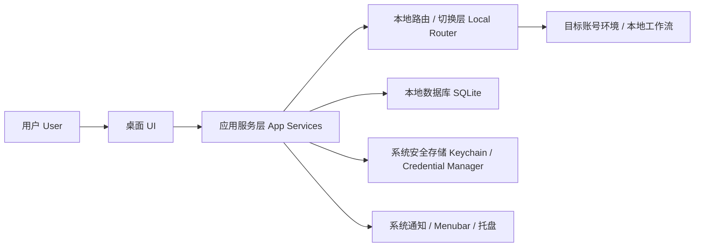
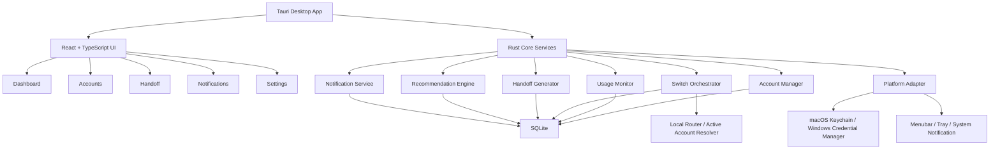
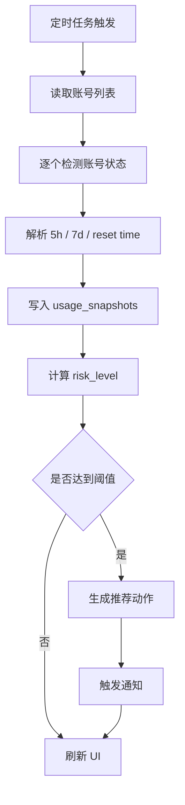
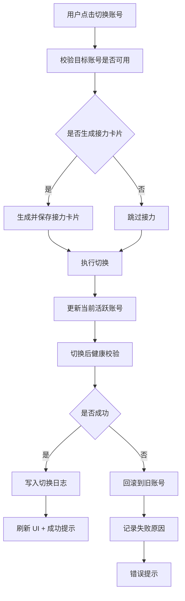
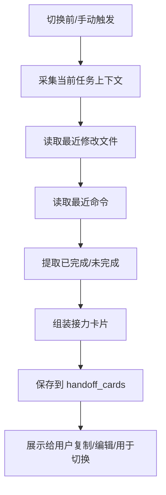
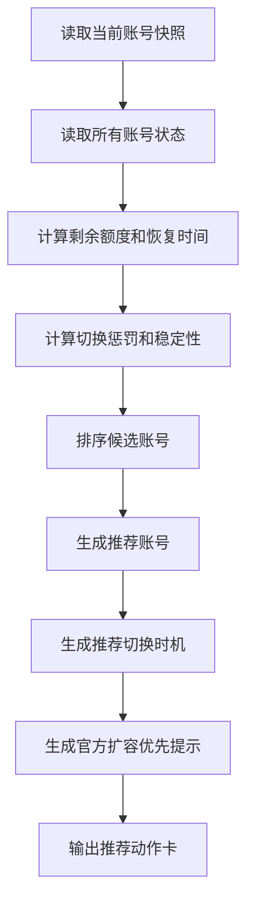

# CodexSwitcher 架构与原型文档

## 1. 文档目标

本文档用于统一沉淀以下内容：

- 信息架构图
- 技术架构图
- 核心流程图
- MVP 原型页面结构图
- 模块结构图
- 低保真线框图

适用范围：

- `CodexSwitcherMac`
- `CodexSwitcherWin`

说明：

- 功能模型尽量统一
- 平台差异主要体现在系统能力层
- 原型以 MVP 为主，不覆盖所有未来增强功能

---

## 2. 产品信息架构图

```mermaid
graph TD
    A["CodexSwitcher"] --> B["仪表盘 Dashboard"]
    A --> C["账号中心 Accounts"]
    A --> D["接力中心 Handoff"]
    A --> E["通知中心 Notifications"]
    A --> F["设置 Settings"]

    B --> B1["当前活跃账号"]
    B --> B2["多账号状态总览"]
    B --> B3["用量历史图表"]
    B --> B4["账号时间轴视图"]
    B --> B5["推荐动作卡"]

    C --> C1["账号列表"]
    C --> C2["添加账号"]
    C --> C3["编辑账号"]
    C --> C4["默认账号设置"]
    C --> C5["登录修复"]

    D --> D1["当前接力卡片"]
    D --> D2["接力历史列表"]
    D --> D3["接力详情"]
    D --> D4["复制/编辑/用于切换"]

    E --> E1["预警通知"]
    E --> E2["切换结果通知"]
    E --> E3["登录失效通知"]
    E --> E4["恢复提醒"]

    F --> F1["阈值设置"]
    F --> F2["检测频率"]
    F --> F3["官方扩容优先"]
    F --> F4["开机启动"]
    F --> F5["Menubar/托盘行为"]
```



### 2.1 平台入口差异

- Mac：`Menubar` 为高频入口，主窗口为详细管理页
- Win：`主窗口` 为主入口，`托盘` 为快捷入口

---

## 3. 整体结构图



### 3.1 结构说明

- UI 负责展示和交互
- App Services 负责业务编排
- Local Router 负责切换和校验
- SQLite 负责元数据、快照、日志、接力卡片
- 安全存储负责敏感凭证

---

## 4. 技术架构图



### 4.1 核心技术职责

#### React + TypeScript

- 页面渲染
- 组件复用
- 图表与时间轴展示
- 状态与交互反馈

#### Rust Core Services

- 账号状态管理
- 用量快照采集
- 切换编排与回滚
- 接力卡片生成
- 推荐引擎

#### Platform Adapter

- Mac：Keychain、Menubar、系统通知、开机自启
- Win：Credential Manager、托盘、系统通知、开机自启

---

## 5. 模块结构图

```mermaid
graph TD
    A["CodexSwitcher Modules"] --> B["UI Module"]
    A --> C["Account Module"]
    A --> D["Usage Module"]
    A --> E["Switch Module"]
    A --> F["Handoff Module"]
    A --> G["Recommendation Module"]
    A --> H["Notification Module"]
    A --> I["Platform Module"]

    B --> B1["StatusTag"]
    B --> B2["MetricCard"]
    B --> B3["ChartCard"]
    B --> B4["TimelineLane"]
    B --> B5["RecommendationCard"]

    C --> C1["Account CRUD"]
    C --> C2["Default Account"]
    C --> C3["Auth State"]

    D --> D1["Sampling Scheduler"]
    D --> D2["Usage Snapshot"]
    D --> D3["History Aggregation"]

    E --> E1["Target Validation"]
    E --> E2["Switch Execution"]
    E --> E3["Switch Rollback"]

    F --> F1["Context Collection"]
    F --> F2["Card Generation"]
    F --> F3["History Storage"]

    G --> G1["Next Account Recommendation"]
    G --> G2["Switch Timing Recommendation"]
    G --> G3["Official Upgrade Recommendation"]

    H --> H1["Warning Notification"]
    H --> H2["Error Notification"]
    H --> H3["Recovery Notification"]

    I --> I1["Menubar / Tray"]
    I --> I2["Keychain / Credential Manager"]
    I --> I3["System Notification"]
```



---

## 6. 核心流程图

## 6.1 额度检测流程



## 6.2 一键切换流程



## 6.3 接力卡片生成流程



## 6.4 推荐引擎流程



---

## 7. MVP 原型页面结构图

## 7.1 首页仪表盘结构图

```text
┌────────────────────────────────────────────────────────────┐
│ 顶部导航：仪表盘 | 账号中心 | 接力中心 | 通知中心 | 设置   │
├────────────────────────────────────────────────────────────┤
│ 当前活跃账号总览卡                                          │
│ Account A | 健康 | 当前窗口 62% | 预计恢复 1h 18m          │
│ [查看官方扩容方案] [生成接力] [切换账号]                    │
├────────────────────────────────────────────────────────────┤
│ 多账号状态总览卡                                            │
│ A 健康 62% | B 健康 34% | C 预警 81%                       │
├────────────────────────────────────────────────────────────┤
│ 用量历史图表                                                │
│ [24h] [3d] [7d]   [5h 窗口] [7d 窗口]                      │
│ 图表区域                                                    │
├────────────────────────────────────────────────────────────┤
│ 账号时间轴视图                                              │
│ [3h] [6h] [12h]                                             │
│ A: 绿色/黄色/红色泳道                                       │
│ B: 绿色/黄色/红色泳道                                       │
├────────────────────────────────────────────────────────────┤
│ 推荐动作卡                                                  │
│ 1. 优先查看官方扩容方案                                     │
│ 2. 推荐切换到 Account B                                     │
│ 3. 建议切换前生成接力卡片                                   │
└────────────────────────────────────────────────────────────┘
```

## 7.2 账号中心结构图

```text
┌────────────────────────────────────────────────────────────┐
│ 账号中心                                      [+ 添加账号] │
├────────────────────────────────────────────────────────────┤
│ 搜索 / 筛选 / 排序                                           │
├────────────────────────────────────────────────────────────┤
│ Account A                                                  │
│ 状态：健康 | 当前使用中 | 默认账号                          │
│ 使用率：62% | 恢复时间：14:10                               │
│ [切换] [重新检测] [编辑] [更多]                             │
├────────────────────────────────────────────────────────────┤
│ Account B                                                  │
│ 状态：健康 | 推荐切换                                       │
│ 使用率：34% | 恢复时间：15:40                               │
│ [切换] [重新检测] [编辑] [更多]                             │
└────────────────────────────────────────────────────────────┘
```

## 7.3 接力中心结构图

```text
┌────────────────────────────────────────────────────────────┐
│ 接力中心                                      [+ 新建接力] │
├────────────────────────────────────────────────────────────┤
│ 最近接力卡片                                                │
│ 任务：退款模块开发                                           │
│ 已完成：接口定义、Service 骨架                              │
│ 未完成：回调幂等、风控校验、单测                            │
│ [复制] [编辑] [用于切换]                                    │
├────────────────────────────────────────────────────────────┤
│ 历史接力列表                                                │
│ - 商品缓存查询优化                                          │
│ - 支付回调重试                                              │
└────────────────────────────────────────────────────────────┘
```

## 7.4 Menubar / 托盘结构图

```text
┌────────────────────────────────────┐
│ CodexSwitcher                      │
│ 当前活跃账号：Account A            │
│ 状态：健康 · 使用 62%              │
│ 预计恢复：1h 18m                   │
├────────────────────────────────────┤
│ 推荐动作                           │
│ [查看官方扩容方案]                 │
│ [切换到 Account B]                 │
├────────────────────────────────────┤
│ 最近接力                           │
│ 退款模块开发                       │
│ [复制接力] [查看详情]              │
├────────────────────────────────────┤
│ [打开主窗口] [设置]                │
└────────────────────────────────────┘
```

---

## 8. 低保真线框图

## 8.1 首页低保真线框图

```text
┌────────────────────────────────────────────────────────────┐
│ CodexSwitcher                                              │
│ 仪表盘 | 账号中心 | 接力中心 | 通知中心 | 设置            │
├────────────────────────────────────────────────────────────┤
│ [当前账号卡片]                                              │
│ 昵称 / 状态标签 / 百分比 / 恢复时间 / 3 个主动作按钮        │
├────────────────────────────────────────────────────────────┤
│ [多账号总览卡]                                              │
│ 每个账号一行：昵称 / 风险 / 百分比 / 推荐标签 / 操作        │
├────────────────────────────────────────────────────────────┤
│ [历史图表卡]                                                │
│ 左上：标题                                                  │
│ 右上：时间切换 + 窗口切换                                   │
│ 中间：折线图                                                │
│ 底部：高峰时段摘要                                          │
├────────────────────────────────────────────────────────────┤
│ [时间轴卡]                                                  │
│ 顶部：3h/6h/12h 切换                                        │
│ 中间：多账号泳道                                            │
│ 底部：推荐路径摘要                                          │
├────────────────────────────────────────────────────────────┤
│ [推荐动作卡]                                                │
│ 仅显示 3 条：扩容 / 切换 / 生成接力                         │
└────────────────────────────────────────────────────────────┘
```

## 8.2 账号中心低保真线框图

```text
┌────────────────────────────────────────────────────────────┐
│ 账号中心                                        [+ 添加账号]│
├────────────────────────────────────────────────────────────┤
│ 搜索框   状态筛选   平台筛选   排序                         │
├────────────────────────────────────────────────────────────┤
│ [账号卡片]                                                  │
│ 昵称                                                        │
│ 平台 / 状态 / 使用率 / 最近检测 / 恢复时间                  │
│ [切换] [重新检测] [编辑] [更多]                             │
├────────────────────────────────────────────────────────────┤
│ [账号卡片]                                                  │
│ ...                                                         │
└────────────────────────────────────────────────────────────┘
```

## 8.3 接力详情页低保真线框图

```text
┌────────────────────────────────────────────────────────────┐
│ 接力详情                                                    │
├────────────────────────────────────────────────────────────┤
│ 任务名称 [输入框]                                           │
│ 当前目标 [输入框]                                           │
│ 已完成   [多行输入框]                                       │
│ 未完成   [多行输入框]                                       │
│ 最近修改文件 [文件标签列表]                                 │
│ 最近命令   [命令标签列表]                                   │
│ 建议续接 Prompt [多行输入框]                                │
├────────────────────────────────────────────────────────────┤
│ [复制接力内容] [保存修改] [用于账号切换] [标星]             │
└────────────────────────────────────────────────────────────┘
```

## 8.4 设置页低保真线框图

```text
┌────────────────────────────────────────────────────────────┐
│ 设置                                                        │
├────────────────────────────────────────────────────────────┤
│ 检测设置                                                    │
│ 检测频率 [1分钟 ▼]                                          │
│ 阈值提醒 [70%] [85%] [95%]                                  │
├────────────────────────────────────────────────────────────┤
│ 切换设置                                                    │
│ [√] 切换前默认生成接力卡片                                  │
│ [√] 切换失败自动回滚                                        │
├────────────────────────────────────────────────────────────┤
│ 官方扩容优先                                                │
│ [√] 额度不足时优先提示官方扩容                              │
├────────────────────────────────────────────────────────────┤
│ 系统设置                                                    │
│ [√] 开机启动                                                │
│ [√] Menubar/托盘运行                                        │
└────────────────────────────────────────────────────────────┘
```

---

## 9. 结构图与原型落地说明

### 9.1 哪些图给谁看

- 信息架构图：给产品、设计、开发统一认知
- 技术架构图：给开发做模块边界和职责划分
- 流程图：给开发和测试确认主链路
- 页面结构图：给设计和前端快速落版
- 低保真线框图：给 UI 和前端作为第一版页面参考

### 9.2 建议落地顺序

1. 先按信息架构确定页面与模块边界
2. 再按技术架构拆模块
3. 用流程图保切换、检测、接力主链路
4. 用页面结构图和低保真线框图开始 UI 开发

### 9.3 下一步建议

如果继续推进，建议补两份文件：

- `DESIGN.md`：专门约束视觉、组件、颜色、间距
- `TASK.md`：把首页、账号中心、接力中心拆成可直接开发的任务单

---

## 10. 2026-04-18 首页落地补充

### 10.1 Dashboard 首页还原原则

Mac 版首页已收敛为 `prototype/index.html` 对应结构，优先级如下：

- 第一优先：保持 prototype 的视觉骨架与信息顺序
- 第二优先：复用现有真实登录、真实绑定、真实校验、真实切换接口
- 第三优先：把真实数据卡片并入首屏，而不是另起一套新布局

当前首页顺序：

1. 当前活跃账号 + 5h/7d 已用 + 5h/7d 恢复 + 可信度
2. 推荐动作
3. 账号总览
4. 用量历史图表
5. 账号时间轴

### 10.2 首屏数据合并要求

图 2 中的数据已合并到首页主卡片，必须展示：

- `5h 已用`
- `7d 已用`
- `5h 预计恢复`
- `7d 预计恢复`
- `可信度`
- `数据来源`
- `本轮采样结果`

要求：

- 这些数据都来自当前真实 overview，不允许补演示值
- 无法读取时统一显示 `未知` 或 `--`
- 尽量在一屏内展示完主路径信息
